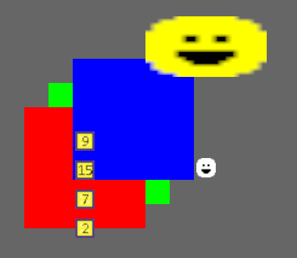

# bevy_mod_ui_sprite
[](https://crates.io/crates/bevy_mod_ui_sprite)
[](https://github.com/ickshonpe/bevy_mod_ui_sprite)
[](https://crates.io/crates/bevy_mod_ui_sprite)

Draw sprites, texture atlas sprites, and coloured rectangles with the Bevy UI.



## Usage

Add the dependency to `Cargo.toml`:

```toml
bevy_mod_ui_sprite = "0.2.0"
```

Add the plugin to your app:

```rust
use bevy_mod_ui_sprite::*;

fn main() {
    App::new()
        .add_plugins(DefaultPlugins)
        .add_plugin(UiSpritePlugin)
        // ..rest of app
        .run()
}
```
Don't forget a camera:

```rust
commands.spawn_bundle(Camera2dBundle::default());
```

Then you can spawn a UiSpriteBundle:

```rust
commands.spawn_bundle(UiSpriteBundle {
    sprite: UiSprite::Image(asset_loader.load("sprite.png")),
    size: SpriteSize::Size(Vec2::new(64., 64.)),
    color: UiColor(Color::YELLOW),
    transform: Transform::from_translation(Vec3::new(100., 100., 100.)),
    ..Default::default()
});
```

## Full Example

```
cargo --run --example example
```

## Notes

Performance should be fine, but this crate is not a substitute for the much more efficient Bevy 2D renderer.